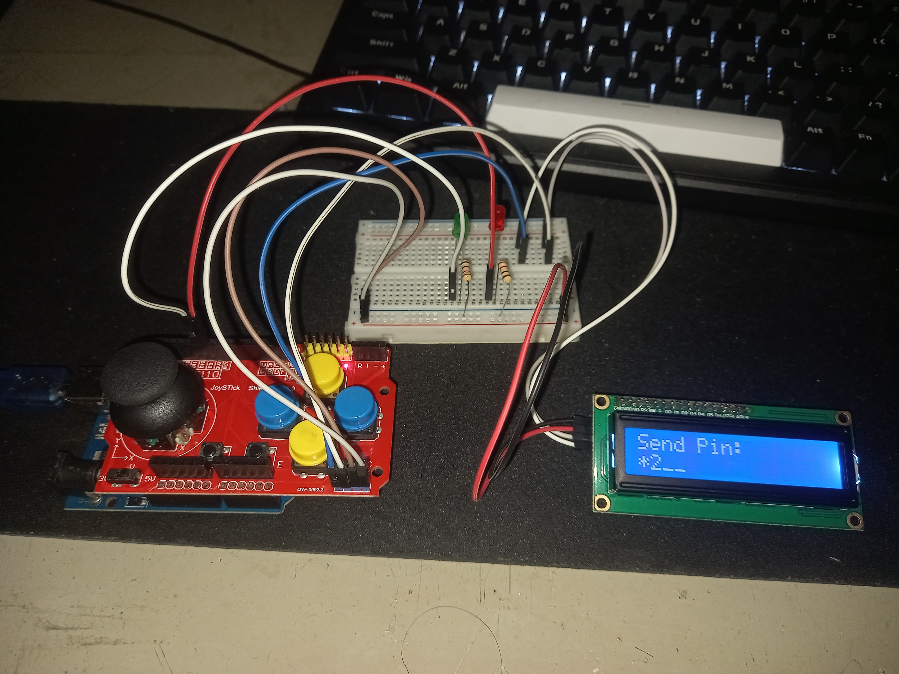

# 🔐 Sistem Verifikasi PIN dengan Arduino

Proyek ini adalah sistem verifikasi PIN sederhana menggunakan **Arduino Uno**, **LCD 16x2**, dan **joystick**, tanpa keypad. Sistem ini memungkinkan pengguna memasukkan kode PIN 4 digit dengan joystick dan tombol, serta menampilkan hasil validasi pada LCD dan LED.

---

## 🛠️ Komponen yang Digunakan

| Komponen        | Jumlah | Keterangan              |
|-----------------|--------|--------------------------|
| Arduino Uno     | 1      | Mikrokontroler utama     |
| LCD 16x2 (I2C)  | 1      | Tampilan menu dan PIN    |
| Joystick        | 1      | Input navigasi PIN       |
| LED Merah       | 1      | Indikator PIN salah      |
| LED Hijau       | 1      | Indikator PIN benar      |
| Tombol (2 buah) | 2      | Untuk submit & kembali   |
| Resistor        | 2      | Untuk LED                |
| Kabel Jumper    | -      | Untuk koneksi            |
| Breadboard      | 1      | Untuk perakitan sementara|

---

## ⚙️ Fitur

- ✅ Input PIN 4 digit menggunakan joystick
- ✅ Indikator PIN benar/salah menggunakan LED
- ✅ Proteksi terhadap input berulang (debounce + edge detection)
- ✅ Tampilan menu dan feedback di LCD
- ✅ Bisa disesuaikan dengan PIN default yang diatur di kode

---

## ⚙️ CARA KERJA

1. Pengguna memilih angka PIN 1 digit demi 1 digit menggunakan joystick.
2. Setiap digit dikonfirmasi dengan menekan tombol "OK" (button C).
3. Setelah semua digit selesai, pengguna menekan tombol "Submit" (button B).
4. Sistem akan mengecek apakah PIN sesuai dengan PIN default (`1234`).
   - Jika benar: LED hijau menyala & pesan "Pin Benar" ditampilkan.
   - Jika salah: LED merah menyala & pesan "Pin Salah" ditampilkan.

---

## 📂 Struktur Kode

- `setup()`: Inisialisasi LCD, LED, button
- `loop()`: Menangani navigasi menu dan verifikasi PIN
- `struct` dan `class`: Mengorganisasi data dan fungsi modular

---

## 📷 Tampilan Proyek

📸 

```cpp
// Contoh tampilan pin input di LCD
LcdPrintWord("Send Pin :", 0, 0);
LcdPrintInt(menu.Pin, a, 1);
